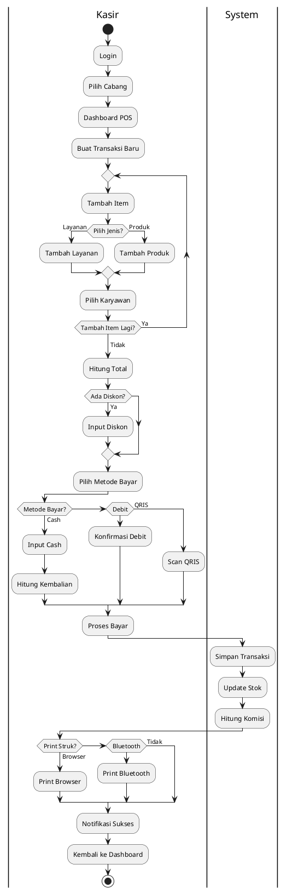
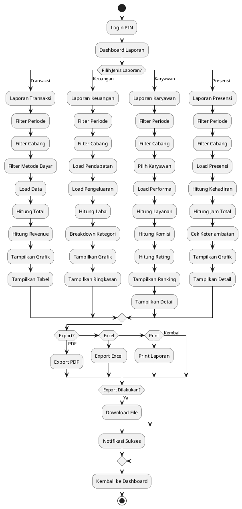
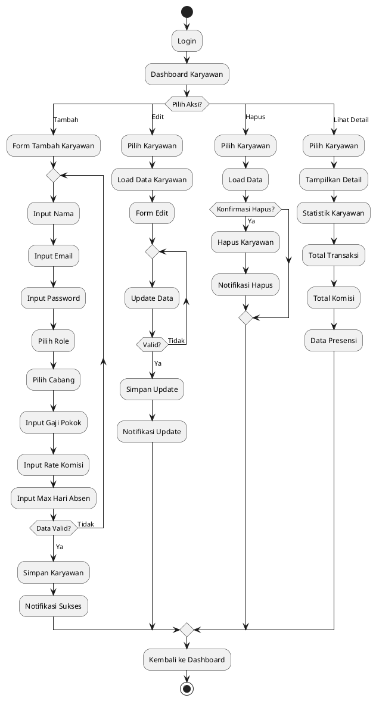
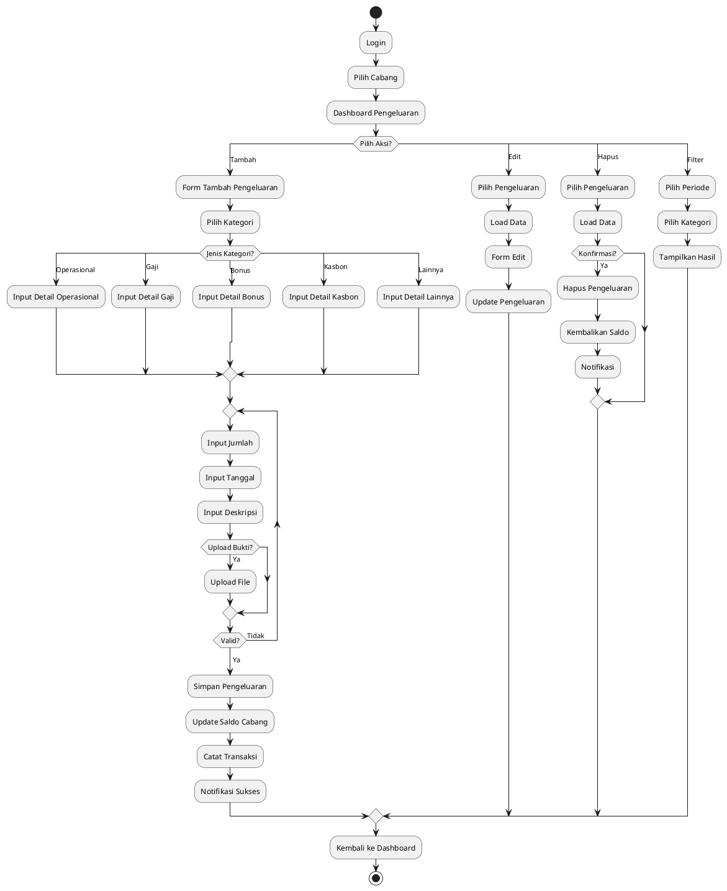
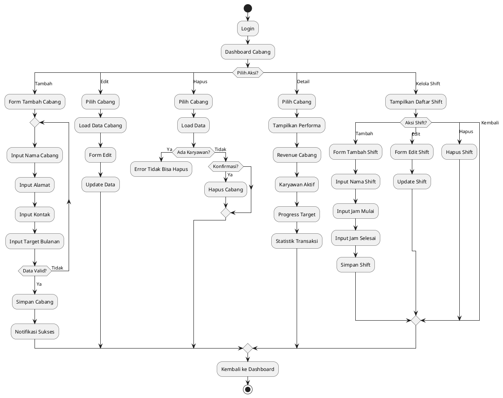

# ACTIVITY DIAGRAM SISTEM PIGTOWNBARBERHOP (PlantUML untuk Draw.io)

## 1. Activity Diagram - Modul POS System



---

## 2. Activity Diagram - Modul Presensi Karyawan

```plantuml
@startuml Presensi_Karyawan
|Karyawan|
start
:Login;
:Menu Presensi;
:Pilih Cabang;

if (Status Hari Ini?) then (Belum Absen)
  :Proses Check-In;
  :Pilih Shift;
  
  repeat
    :Ambil Foto Selfie;
  repeat while (Foto Valid?) is (Tidak)
  -> Ya;
  
  :Upload Foto;
  :Simpan Check-In;
  :Catat Waktu Masuk;
  :Notifikasi Berhasil;
  :Status Bekerja;
  
  repeat
    if (Pilih Aktivitas?) then (Mulai Break)
      :Mulai Istirahat;
      :Catat Waktu Break;
      :Notifikasi Break;
      :Status Istirahat;
      
    elseif (Selesai Break) then
      :Selesai Istirahat;
      :Catat Selesai Break;
      :Hitung Durasi;
      :Notifikasi Selesai;
      backward:Lanjut Bekerja;
      
    else (Check-Out)
      repeat
        :Ambil Foto Selfie;
      repeat while (Foto Valid?) is (Tidak)
      -> Ya;
      
      :Upload Foto;
      :Simpan Check-Out;
      :Catat Waktu Keluar;
      :Hitung Jam Kerja;
      :Update Status;
      :Notifikasi Berhasil;
      detach
    endif
  repeat while (Masih Bekerja?) is (Ya)
  
elseif (Sudah Check-In) then
  :Menu Aktivitas;
  detach
  
else (Sudah Check-Out)
  :Info Sudah Selesai;
endif

stop
@enduml
```

---

## 3. Activity Diagram - Modul Kasbon (Karyawan)

```plantuml
@startuml Kasbon_Karyawan
|Karyawan|
start
:Login;
:Menu Kasbon;
:Load Daftar Kasbon;

if (Ada Kasbon Aktif?) then (Ya)
  :Tampilkan Detail;
  :Tampilkan Sisa Hutang;
  :Progress Bar;
  :Tanggal Jatuh Tempo;
  
  if (Mendekati Deadline?) then (Ya)
    :Tampilkan Warning;
  endif
  
  if (Pilih Aksi?) then (Bayar Cicilan)
    repeat
      :Input Jumlah Bayar;
    repeat while (Valid?) is (Tidak)
    -> Ya;
    
    :Proses Bayar;
    :Update Sisa Hutang;
    
    if (Lunas?) then (Ya)
      :Status Lunas;
    else (Tidak)
      :Status Cicilan;
    endif
    
    :Notifikasi;
    backward:Load Daftar Kasbon;
    
  elseif (Ajukan Baru) then
    forward:Ke Form Pengajuan;
  else (Kembali)
    stop
  endif
endif

:Form Pengajuan Baru;

repeat
  :Input Jumlah;
  :Input Alasan;
  :Input Jatuh Tempo;
repeat while (Data Valid?) is (Tidak)
-> Ya;

:Kirim Pengajuan;
:Simpan;
:Status Menunggu;
:Notifikasi Admin;

:Menunggu Approval;
note right: Proses di sisi Admin

if (Hasil Approval?) then (Ditolak)
  :Notifikasi Ditolak;
  :Lihat Alasan;
  backward:Load Daftar Kasbon;
else (Disetujui)
  :Notifikasi Disetujui;
  :Kasbon Aktif Baru;
  backward:Load Daftar Kasbon;
endif

stop
@enduml
```

---

## 4. Activity Diagram - Modul Kasbon (Admin/Owner)

```plantuml
@startuml Kasbon_Admin
|Admin/Owner|
start
:Login;
:Dashboard Kasbon;
:Load Pengajuan Pending;

if (Ada Pengajuan?) then (Ya)
  :Tampilkan List;
  :Pilih Pengajuan;
  :Detail Karyawan;
  :Jumlah Kasbon;
  :Alasan;
  :Jatuh Tempo;
  :History Kasbon;
  
  :Review Admin;
  
  if (Keputusan?) then (Tolak)
    repeat
      :Input Alasan Tolak;
    repeat while (Alasan Valid?) is (Tidak)
    -> Ya;
    
    :Simpan Penolakan;
    :Update Status Ditolak;
    
    |System|
    :Notifikasi Karyawan;
    
    |Admin/Owner|
    backward:Load Pengajuan Pending;
    
  else (Setuju)
    if (Konfirmasi?) then (OK)
      :Simpan Persetujuan;
      :Update Status Disetujui;
      :Catat Hutang;
      
      |System|
      :Notifikasi Karyawan;
      
      |Admin/Owner|
      backward:Load Pengajuan Pending;
    else (Batal)
      backward:Review Admin;
    endif
  endif
else (Tidak)
  :Lihat Riwayat;
endif

stop
@enduml
```

---

## 5. Activity Diagram - Modul Laporan & Analytics



---

## 6. Activity Diagram - Modul Manajemen Karyawan



---

## 7. Activity Diagram - Modul Pengeluaran Cabang



---

## 8. Activity Diagram - Modul Perhitungan Gaji

```plantuml
@startuml Perhitungan_Gaji
|Owner|
start
:Login PIN;
:Dashboard Gaji;
:Pilih Periode Gaji;
:Pilih Cabang;

|System|
:Load Data Karyawan;
:Proses Perhitungan;
:Ambil Gaji Pokok;
:Ambil Data Presensi;
:Hitung Hari Kerja;
:Ambil Total Komisi;
:Ambil Total Bonus;
:Ambil Total Penalty;
:Ambil Sisa Kasbon;
:Hitung Total;

if (Ada Potongan Absen?) then (Ya)
  :Hitung Potongan;
  :Kurangi dari Total;
endif

:Gaji Bersih;

|Owner|
:Tampilkan Ringkasan;

repeat
  if (Review Gaji?) then (Revisi)
    :Adjustment Manual;
    backward:Recalculate;
  else (Approve)
  endif
repeat while (Approved?) is (Tidak)
-> Ya;

if (Konfirmasi Bayar?) then (Ya)
  |System|
  :Proses Pembayaran;
  :Status Dibayar;
  :Catat Tanggal Bayar;
  :Update Status Kasbon;
  :Reset Komisi;
  :Catat Pengeluaran;
  :Notifikasi Karyawan;
  :Generate Laporan;
else (Tidak)
  :Simpan Draft;
endif

stop
@enduml
```

---

## 9. Activity Diagram - Modul Manajemen Cabang



---

## 10. Activity Diagram - Modul Dashboard Owner

```plantuml
@startuml Dashboard_Owner
start
:Input PIN Owner;

repeat
repeat while (PIN Valid?) is (Tidak)
-> Ya;

:Dashboard Owner;

|System|
:Load Data Real-time;

|Owner|
:Tampilkan Metrik Bisnis;
:Total Revenue Hari Ini;
:Total Transaksi;
:Total Pengeluaran;
:Laba Bersih;
:Grafik Trend 7 Hari;
:Performa per Cabang;
:Top Karyawan;
:Kasbon Aktif;

switch (Pilih Menu?)
case (Laporan)
  :Ke Modul Laporan;
  detach
case (Gaji)
  :Ke Modul Gaji;
  detach
case (Cabang)
  :Ke Modul Cabang;
  detach
case (Karyawan)
  :Ke Modul Karyawan;
  detach
case (Settings)
  :Settings Akun;
  
  switch (Pilih Setting?)
  case (Ubah Email)
    repeat
      :Form Ubah Email;
    repeat while (Valid?) is (Tidak)
    -> Ya;
    :Update Email;
  case (Ubah Password)
    repeat
      :Form Ubah Password;
    repeat while (Valid?) is (Tidak)
    -> Ya;
    :Update Password;
  case (Ubah PIN)
    repeat
      :Form Ubah PIN;
    repeat while (Valid?) is (Tidak)
    -> Ya;
    :Update PIN;
  case (Kembali)
  endswitch
  
  backward:Dashboard Owner;
  
case (Refresh)
  backward:Load Data Real-time;
  
case (Logout)
  stop
endswitch
@enduml
```

---

## Cara Menggunakan di Draw.io:

### Metode 1: Import PlantUML (Paling Mudah)
1. Buka Draw.io: **https://app.diagrams.net/**
2. Klik menu **Arrange** → **Insert** → **Advanced** → **PlantUML...**
3. Copy-paste salah satu code PlantUML dari diagram di atas
4. Klik **Insert PlantUML**
5. Diagram akan otomatis ter-render
6. Bisa edit layout dengan drag-drop

### Metode 2: Via PlantUML Web Server
1. Buka: **https://www.plantuml.com/plantuml/uml/**
2. Paste code PlantUML
3. Klik **Submit** untuk generate
4. Download sebagai:
   - PNG (untuk Word/PDF)
   - SVG (untuk kualitas vector)
5. Import hasil download ke Draw.io atau langsung ke proposal

### Metode 3: VS Code + PlantUML Extension
1. Install extension: **PlantUML** by jebbs
2. Buat file baru: `diagram.puml`
3. Paste code PlantUML
4. Press `Alt+D` untuk preview
5. Right-click → Export → PNG/SVG

---

## Keterangan PlantUML Syntax untuk Activity Diagram:

```plantuml
start / stop              // Start/End flowchart
:Activity;               // Activity node (rectangle)
if (condition?) then     // Decision node (diamond)
switch (choice?) / case  // Multi-way decision
repeat / repeat while    // Loop
|Actor|                  // Swimlane/partition
forward: / backward:     // Jump to another part
detach                   // End alternative path
note right/left          // Add note/comment
-> Label;                // Label on arrow
```

---

## Export untuk Proposal:

### Dari Draw.io:
1. **File** → **Export as** → **PNG**
   - Resolution: **300 DPI** (print quality)
   - Transparent: **Optional**
   - Border: **5-10 px**

2. **File** → **Export as** → **SVG**
   - Vector format (scalable)
   - Perfect untuk dokumen digital

3. **File** → **Export as** → **PDF**
   - Direct export untuk proposal

### Dari PlantUML Server:
1. Setelah generate, klik **PNG** atau **SVG**
2. Save dengan nama deskriptif: `activity_pos_system.png`
3. Insert ke dokumen proposal

---

## Tips Layout di Draw.io:

1. **Auto-arrange**: Klik **Arrange** → **Layout** → **Vertical Flow** (after import)
2. **Spacing**: Atur jarak antar node agar tidak terlalu rapat
3. **Colors**: Gunakan color palette konsisten:
   - Start/Stop: Green/Red
   - Activity: Blue
   - Decision: Yellow/Orange
   - Swimlane: Light gray background
4. **Font**: Gunakan Arial atau Helvetica, size 11-12pt
5. **Shadow**: Enable shadow untuk tampilan lebih profesional

---

## Checklist Proposal:

✅ **5 Flowchart Proses Bisnis** (file: FLOWCHART_PROSES_BISNIS_UML.md)
- Transaksi POS
- Presensi Karyawan
- Kasbon Workflow
- Pengeluaran Cabang
- Perhitungan Gaji

✅ **10 Activity Diagram Modul** (file ini)
1. POS System
2. Presensi Karyawan
3. Kasbon (Karyawan)
4. Kasbon (Admin/Owner)
5. Laporan & Analytics
6. Manajemen Karyawan
7. Pengeluaran Cabang
8. Perhitungan Gaji
9. Manajemen Cabang
10. Dashboard Owner

---

## Struktur Proposal yang Disarankan:

### BAB 2: LANDASAN TEORI
- 2.1 Sistem Informasi
- 2.2 Barbershop Management System
- 2.3 Point of Sale (POS)
- 2.4 Attendance System
- 2.5 Payroll System

### BAB 3: ANALISIS DAN PERANCANGAN
- 3.1 Analisis Sistem Berjalan
- 3.2 Analisis Kebutuhan
  - 3.2.1 Kebutuhan Functional
  - 3.2.2 Kebutuhan Non-Functional
- **3.3 Flowchart Proses Bisnis**
  - 3.3.1 Flowchart Transaksi POS ← Insert diagram
  - 3.3.2 Flowchart Presensi ← Insert diagram
  - 3.3.3 Flowchart Kasbon ← Insert diagram
  - 3.3.4 Flowchart Pengeluaran ← Insert diagram
  - 3.3.5 Flowchart Gaji ← Insert diagram
- **3.4 Activity Diagram**
  - 3.4.1 Activity Diagram POS ← Insert diagram
  - 3.4.2 Activity Diagram Presensi ← Insert diagram
  - ... (dan seterusnya untuk 10 diagram)
- 3.5 Use Case Diagram (jika diperlukan)
- 3.6 Entity Relationship Diagram (jika diperlukan)
- 3.7 Perancangan Database

---

## Catatan Penting:

✅ **Sudah disesuaikan:**
- Semua modul sesuai sistem aktual
- Tidak ada fitur membership/poin
- Sudah cover semua workflow utama

✅ **Format PlantUML:**
- Compatible dengan Draw.io
- Mudah diedit
- Professional output
- Support swimlane (multi-actor)

✅ **Coverage Lengkap:**
- Semua role: Kasir, Karyawan, Admin, Owner
- Semua modul utama sistem
- Happy path + error handling

---

## Kontak Tim Pengembang:
- Ari Setia Hinanda
- Bayu Nurcahyo
- M. Ari Affandi
- M. Risky Ardiansyah

**Sistem:** PIGTOWNBARBERHOP Management System  
**Tech Stack:** Next.js 14 + Supabase + TypeScript
