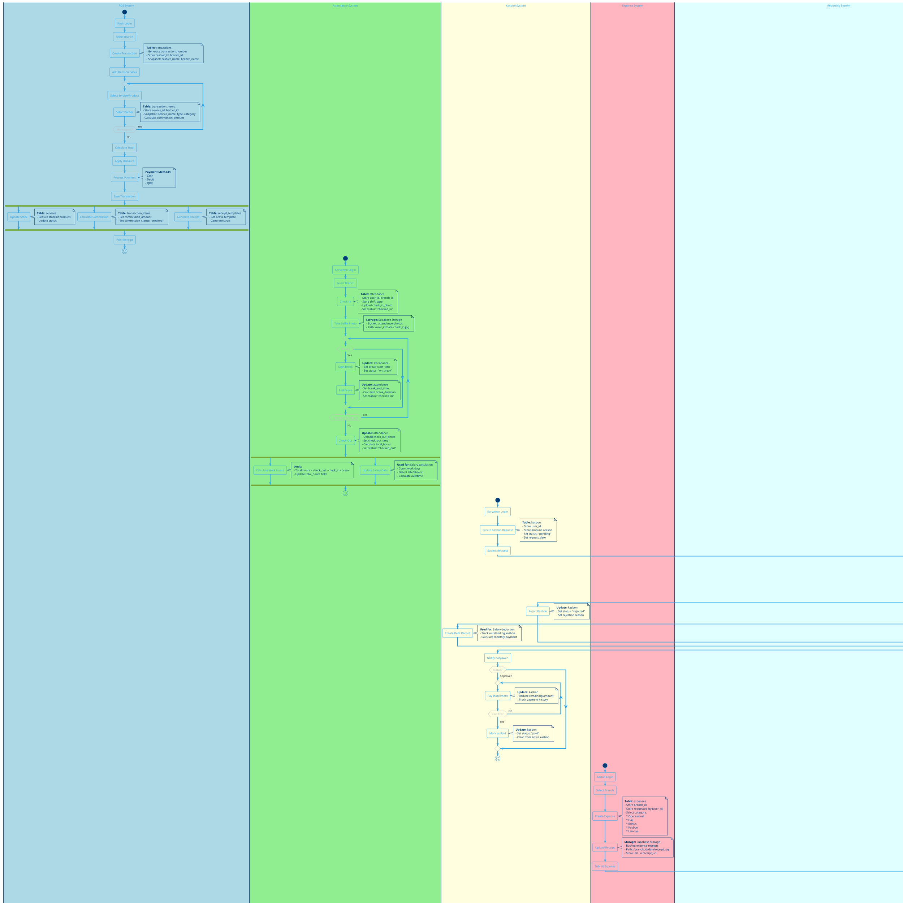
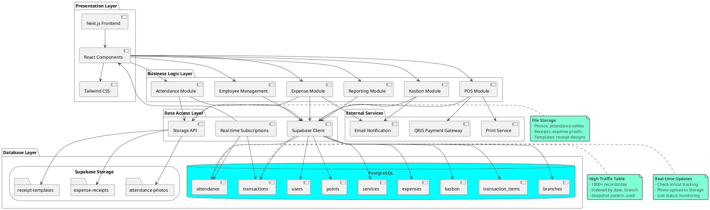
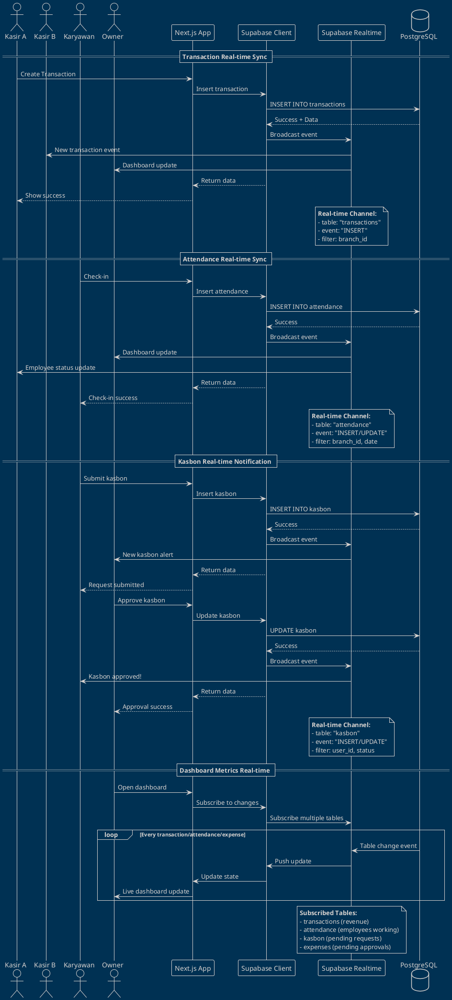

# BAGAN DATABASE LOGISTIK SISTEM PIGTOWNBARBERHOP (PlantUML)

## Diagram Alur Data & Logistik Database



---

## 2. Diagram Arsitektur Data Flow



---

## 3. Diagram Data Sync & Real-time Flow



---

## Penjelasan Bagan Database Logistik:

### **1. Alur Data POS System:**
1. **Input:** Kasir → Transaction → Items → Payment
2. **Process:** 
   - Generate transaction_number
   - Save transaction + items
   - Snapshot data (names, prices)
   - Calculate commission
3. **Output:**
   - Update stock
   - Credit commission
   - Print receipt
   - Update dashboard

### **2. Alur Data Attendance System:**
1. **Input:** Check-in → Photo → Shift selection
2. **Process:**
   - Upload photo to Storage
   - Save attendance record
   - Track break times
   - Calculate work hours
3. **Output:**
   - Real-time status update
   - Work hours calculation
   - Salary data preparation

### **3. Alur Data Kasbon System:**
1. **Input:** Karyawan request → Amount + reason
2. **Process:**
   - Save kasbon (status: pending)
   - Notify admin/owner
   - Admin review + approve/reject
   - Update status
3. **Output:**
   - Debt tracking
   - Salary deduction data
   - Payment installments

### **4. Alur Data Expense System:**
1. **Input:** Admin request → Category + amount + receipt
2. **Process:**
   - Upload receipt to Storage
   - Save expense (status: pending)
   - Owner review + approve/reject
   - Update branch balance
3. **Output:**
   - Financial records
   - Budget tracking
   - Report data

### **5. Alur Data Reporting System:**
1. **Input:** Owner select report type + filters
2. **Process:**
   - Query multiple tables
   - Join related data
   - Aggregate metrics
   - Calculate statistics
3. **Output:**
   - Dashboard visualization
   - Export PDF/Excel/CSV
   - Real-time charts

---

## Keunggulan Arsitektur Database:

### **✅ Real-time Capabilities:**
- Supabase Realtime untuk live updates
- Dashboard metrics update otomatis
- Attendance status real-time
- Transaction notifications instant

### **✅ Scalability:**
- PostgreSQL handle high traffic
- Indexed queries untuk performance
- Supabase auto-scaling
- Connection pooling

### **✅ Data Integrity:**
- Foreign key constraints
- Transaction ACID compliance
- Snapshot pattern untuk historical accuracy
- Soft delete untuk data preservation

### **✅ Security:**
- Row Level Security (RLS) policies
- Branch-based data isolation
- Role-based access control
- Encrypted storage

### **✅ Backup & Recovery:**
- Automated daily backups
- Point-in-time recovery
- Supabase managed backups
- Manual export capabilities

---

## Storage Buckets Structure:

```
supabase-storage/
├── attendance-photos/
│   ├── {user_id}/
│   │   ├── {date}/
│   │   │   ├── check_in.jpg
│   │   │   └── check_out.jpg
│   │   └── ...
│   └── ...
│
├── expense-receipts/
│   ├── {branch_id}/
│   │   ├── {date}/
│   │   │   ├── receipt_001.jpg
│   │   │   ├── receipt_002.pdf
│   │   │   └── ...
│   │   └── ...
│   └── ...
│
└── receipt-templates/
    ├── template_default.json
    ├── template_branch1.json
    └── ...
```

---

## Performance Optimization:

### **Database Indexes:**
```sql
-- High Priority Indexes
CREATE INDEX idx_trans_created ON transactions(created_at DESC);
CREATE INDEX idx_trans_branch ON transactions(branch_id, created_at);
CREATE INDEX idx_items_barber ON transaction_items(barber_id, created_at);
CREATE INDEX idx_attend_date ON attendance(user_id, date DESC);
CREATE INDEX idx_kasbon_status ON kasbon(status, user_id);
```

### **Query Optimization:**
- Use `select()` dengan specific columns
- Avoid `select('*')` untuk large tables
- Use pagination untuk list views
- Cache frequently accessed data
- Use RPC functions untuk complex queries

### **Real-time Optimization:**
- Subscribe only to needed channels
- Use filters to reduce payload
- Unsubscribe when component unmounts
- Batch updates where possible

---

## Cara Import ke Draw.io:

### **Metode 1: PlantUML Plugin**
1. Buka Draw.io: https://app.diagrams.net/
2. **Arrange** → **Insert** → **Advanced** → **PlantUML...**
3. Copy-paste code diagram di atas
4. Klik **Insert PlantUML**

### **Metode 2: PlantUML Server**
1. Buka: https://www.plantuml.com/plantuml/uml/
2. Paste code
3. Generate & download
4. Import ke Draw.io

---

## Monitoring & Analytics:

**Key Metrics to Track:**
- Transaction throughput (per second)
- Database query performance
- Storage usage growth
- Real-time connection count
- API response times
- Error rates
- User session duration

**Tools:**
- Supabase Dashboard (built-in analytics)
- PostgreSQL EXPLAIN for query analysis
- Browser DevTools for client performance
- Custom logging untuk business metrics

---

## Kontak Tim Pengembang:
- Ari Setia Hinanda
- Bayu Nurcahyo
- M. Ari Affandi
- M. Risky Ardiansyah

**Sistem:** PIGTOWNBARBERHOP Management System  
**Database:** PostgreSQL 15 + Supabase  
**Real-time:** Supabase Realtime (WebSocket)  
**Storage:** Supabase Storage (S3-compatible)
