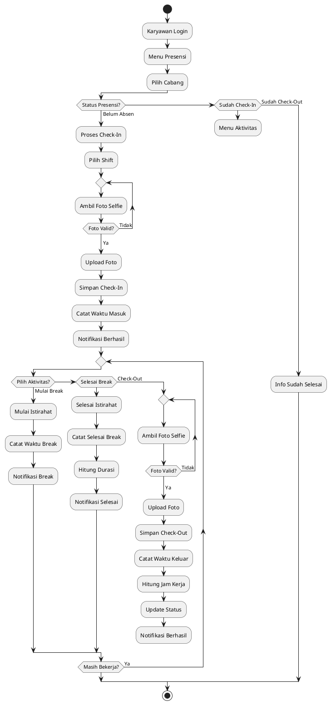
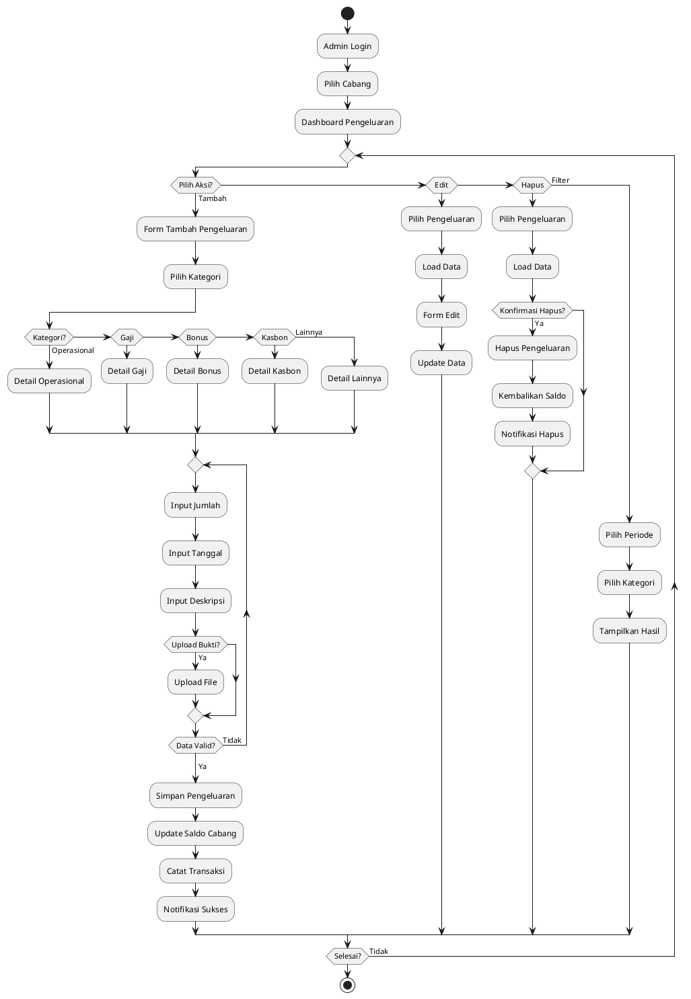

@startuml Transaksi_POS
start
:Kasir Login;
:Pilih Cabang;
:Dashboard POS;
:Buat Transaksi Baru;

repeat
  :Tambah Item;
  
  if (Pilih Jenis?) then (Layanan)
    :Tambah Layanan;
  else (Produk)
    :Tambah Produk;
  endif
  
  :Pilih Karyawan;
  
repeat while (Tambah Item Lagi?) is (Ya)
-> Tidak;

:Hitung Total;

if (Ada Diskon?) then (Ya)
  :Input Diskon;
endif

:Pilih Metode Bayar;

if (Metode Bayar?) then (Cash)
  :Input Jumlah Cash;
  :Hitung Kembalian;
elseif (Debit) then
  :Konfirmasi Debit;
else (QRIS)
  :Scan QRIS;
endif

:Proses Pembayaran;
:Simpan ke Database;
:Update Stok Produk;
:Hitung Komisi Karyawan;

if (Print Struk?) then (Browser)
  :Print via Browser;
elseif (Bluetooth) then
  :Print via Bluetooth;
else (Tidak)
endif

:Notifikasi Sukses;
stop
@enduml
```

## 2. Flowchart Proses Presensi Karyawan



## 3. Flowchart Pengajuan dan Approval Kasbon

```plantuml
@startuml Kasbon_Workflow
|Karyawan|
start
:Karyawan Login;
:Menu Kasbon;
:Load Daftar Kasbon;

if (Ada Kasbon Aktif?) then (Ya)
  :Tampilkan Detail;
  :Tampilkan Sisa Hutang;
  :Progress Bar;
  :Tanggal Jatuh Tempo;
  
  if (Mendekati Deadline?) then (Ya)
    :Tampilkan Warning;
  endif
  
  if (Pilih Aksi?) then (Bayar Cicilan)
    repeat
      :Input Jumlah Bayar;
    repeat while (Valid?) is (Tidak)
    -> Ya;
    
    :Proses Bayar;
    :Update Sisa Hutang;
    
    if (Lunas?) then (Ya)
      :Status Lunas;
    else (Tidak)
      :Status Cicilan;
    endif
    
    :Notifikasi;
    stop
    
  elseif (Ajukan Baru) then
  else (Kembali)
    stop
  endif
endif

:Form Pengajuan Baru;

repeat
  :Input Jumlah;
  :Input Alasan;
  :Input Jatuh Tempo;
repeat while (Data Valid?) is (Tidak)
-> Ya;

:Kirim Pengajuan;
:Simpan;
:Status Menunggu;

|Admin/Owner|
:Notifikasi Admin;
:Menunggu Approval;
:Admin Login;
:Dashboard Kasbon;
:Load Pengajuan Pending;

if (Ada Pengajuan?) then (Ya)
  :Tampilkan List;
  :Pilih Pengajuan;
  :Detail Karyawan;
  :Jumlah Kasbon;
  :Alasan;
  :Jatuh Tempo;
  :History Kasbon;
  
  :Review Admin;
  
  if (Keputusan?) then (Tolak)
    repeat
      :Input Alasan Tolak;
    repeat while (Alasan Valid?) is (Tidak)
    -> Ya;
    
    :Simpan Penolakan;
    :Update Status Ditolak;
    
    |Karyawan|
    :Notifikasi Karyawan;
    stop
    
  else (Setuju)
    if (Konfirmasi?) then (OK)
      :Simpan Persetujuan;
      :Update Status Disetujui;
      :Catat Hutang;
      
      |Karyawan|
      :Notifikasi Karyawan;
      :Kasbon Aktif;
      stop
    else (Batal)
      detach
    endif
  endif
else (Tidak)
  :Lihat Riwayat;
  stop
endif
@enduml
```

## 4. Flowchart Pengelolaan Pengeluaran Cabang



## 5. Flowchart Perhitungan Gaji Karyawan

```plantuml
@startuml Perhitungan_Gaji
start
:Owner Login PIN;
:Dashboard Gaji;
:Pilih Periode Gaji;
:Pilih Cabang;
:Load Data Karyawan;

:Proses Perhitungan;
:Ambil Gaji Pokok;
:Ambil Data Presensi;
:Hitung Hari Kerja;
:Ambil Total Komisi;
:Ambil Total Bonus;
:Ambil Total Penalty;
:Ambil Sisa Kasbon;

:Hitung Total;
note right
  **Formula Gaji:**
  Gaji Pokok + Komisi 
  + Bonus - Penalty 
  - Kasbon
end note

if (Ada Potongan Absen?) then (Ya)
  :Hitung Potongan;
  :Kurangi dari Total;
endif

:Gaji Bersih;
:Tampilkan Ringkasan;

repeat
  if (Review Gaji?) then (Revisi)
    :Adjustment Manual;
    backward:Recalculate;
  else (Approve)
  endif
repeat while (Approved?) is (Tidak)
-> Ya;

if (Konfirmasi Bayar?) then (Ya)
  :Proses Pembayaran;
  :Status Dibayar;
  :Catat Tanggal Bayar;
  :Update Status Kasbon;
  :Reset Komisi;
  :Catat ke Pengeluaran;
  :Notifikasi Karyawan;
  :Generate Laporan;
else (Tidak)
  :Simpan Draft;
endif

stop
@enduml
```

---

## Cara Menggunakan di Draw.io:

### Metode 1: Import PlantUML Langsung (Recommended)
1. Buka Draw.io: https://app.diagrams.net/
2. Klik menu **Arrange** → **Insert** → **Advanced** → **PlantUML...**
3. Copy-paste salah satu code PlantUML dari diagram di atas
4. Klik **Insert PlantUML**
5. Diagram akan otomatis ter-render dan bisa diedit

### Metode 2: Via PlantUML Server
1. Buka: https://www.plantuml.com/plantuml/uml/
2. Paste code PlantUML
3. Generate diagram
4. Download sebagai PNG/SVG
5. Import image ke Draw.io

### Metode 3: Draw Manual di Draw.io
1. Buka Draw.io
2. Gunakan shape dari library "Basic Shapes" dan "Flowchart":
   - **Ellipse** untuk Start/Stop
   - **Rectangle** untuk Process
   - **Diamond** untuk Decision
   - **Arrow** untuk Flow
3. Ikuti struktur dari diagram PlantUML sebagai panduan layout

---

## Export untuk Proposal:

### Dari Draw.io:
1. **File** → **Export as** → **PNG**
   - Set resolution: **300 DPI** (untuk print quality)
   - Enable: **Transparent Background** (optional)
   - Enable: **Shadow** untuk tampilan lebih profesional

2. **File** → **Export as** → **SVG**
   - SVG untuk kualitas vector (scalable tanpa pecah)
   - Cocok untuk dokumen digital

3. **File** → **Export as** → **PDF**
   - Langsung untuk insert ke proposal

---

## Keterangan PlantUML Syntax:

```plantuml
start                    // Mulai flowchart
:Activity;              // Activity/Process box
if (condition?) then    // Decision (diamond)
  :Action 1;
elseif (condition2) then
  :Action 2;
else
  :Action 3;
endif
repeat                  // Loop start
  :Repeated action;
repeat while (condition?) is (Ya)
-> Tidak;              // Label pada arrow
stop                   // End flowchart
detach                 // End alternatif
backward:Back action;  // Arrow mundur
|Actor|                // Swimlane/partition
note right/left        // Catatan
```

---

## Catatan Penting:

✅ **Sudah disesuaikan dengan sistem aktual:**
- POS System (Cash, Debit, QRIS)
- Presensi dengan foto selfie + break management
- Kasbon dengan approval workflow
- Pengeluaran 5 kategori (Operasional, Gaji, Bonus, Kasbon, Lainnya)
- Perhitungan gaji lengkap

✅ **Format PlantUML:**
- Compatible dengan Draw.io via plugin
- Mudah diedit text-nya
- Otomatis generate layout
- Professional output

❌ **Tidak ada:**
- Fitur membership/poin (sistem tidak punya)
- Data customer (transaksi langsung tanpa registrasi member)

---

## Tips Membuat Proposal yang Baik:

1. **Judul Diagram:** Beri judul jelas di proposal (contoh: "Gambar 2.1 Flowchart Proses Transaksi POS")
2. **Penjelasan:** Tambahkan 1-2 paragraf penjelasan di bawah setiap diagram
3. **Numbering:** Gunakan numbering konsisten (2.1, 2.2, dst untuk BAB 2)
4. **Resolusi:** Pastikan diagram tidak pecah saat dicetak (minimal 300 DPI)
5. **Konsistensi:** Gunakan warna dan style yang sama untuk semua diagram
